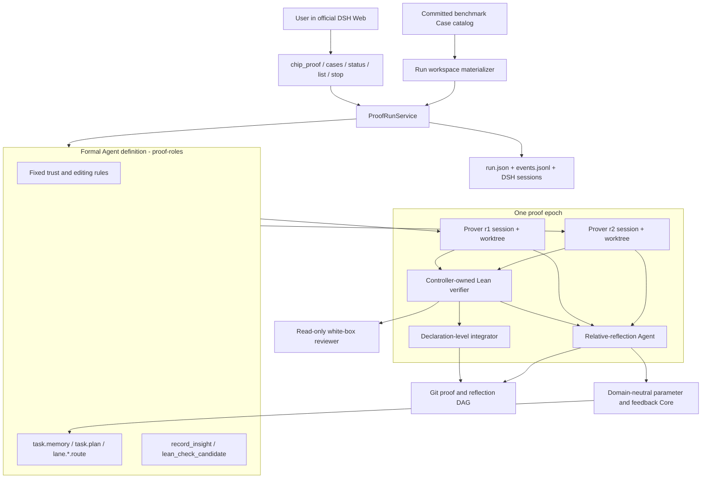

# DSH-native formal-proof architecture

[简体中文](../../zh-CN/architecture/dsh-formal-proof-bundle.md)

## System boundary

Formal proof is the first domain application of the Token Optimization Core. `proof-roles` defines the Formal Prover Agent architecture; Core does not. The installable Bundle composes this Agent with an autonomous Reflector, deterministic Lean verification, Git-backed state, observability, and user controls over the official DSH Code Agent and Agent Loop.

The first release has one deliberate mode: reproducible experiments over immutable, repository-owned Cases. Arbitrary user workspaces are outside this boundary and tracked in [Issue #4](https://github.com/BruceLoveLee000/tokens-as-parameters/issues/4).



The Bundle contains composition only. It does not reimplement the Code Agent, Agent Loop, filesystem/shell tools, context compaction, credentials, token accounting, session persistence, or Web trajectory UI.

## Formal Prover Agent architecture

`proof-roles` owns the domain meaning and context layout of the target Agent.

| Surface | First-release definition | Feedback status |
|---|---|---|
| immutable task | committed Case identity, locked manifest, theorem, model/spec inputs, and user run request | input; never updated by reflection |
| fixed system policy | editable surface, trust boundary, anti-reward-hacking rules, Insight behavior | frozen in this experiment |
| `task.memory` | concise verifier-backed facts, reusable discoveries, and invalidated assumptions | selectable per Agent instance; enabled by default |
| `task.plan` | shared proof-search policy and prioritization | selectable; enabled by default |
| `lane.<id>.route` | lane-specific independent assignment | selectable; enabled by default |
| tools | official Code Agent tools plus `record_insight` and `lean_check_candidate` | frozen in this experiment |
| Skills | supplied by the installed DSH environment | no FDIV-specific Skill is bundled |

This table is the model definition for the current experiment. Core merely validates and versions the registered parameters. A future mathematical prover or Code Agent trainer can register different ids and descriptions without changing Core.

The three parameter sections have stable context positions. Before each Prover session, Runtime records a context snapshot containing their exact revisions. The Reflector can therefore ask “where was this parameter revision used and what did the checker observe?” instead of inferring attribution from prose.

## Run and epoch flow

Every start creates a new `runId`; separate Runs do not inherit mutable proof or parameter state. The source Case is copied into `<runRoot>/<runId>/workspace`, generated/dependency directories are excluded, locked hashes are checked again, and a new Git repository freezes the Run baseline. Within a Run, state advances across Epochs. No candidate is written back to the source Case.

```mermaid
sequenceDiagram
  participant U as User
  participant C as Proof controller
  participant P as Parallel Provers
  participant L as Lean verifier
  participant I as Integrator
  participant R as Reflector Agent
  participant G as Git / run ledger

  U->>C: start(registered case id, budget, rollout count)
  C->>G: verify clean source commit; copy Case; initialize Run Git baseline
  C->>L: preflight frozen baseline
  loop until proof or terminal budget
    C->>P: parameter state vN + isolated sessions/worktrees
    P->>P: search, use tools, record Insights, continue after request max-token boundaries
    P-->>L: candidate artifacts
    L-->>C: build, hygiene, signature, locked-input, obligation and axiom receipts
    C->>I: semantically transplant newly closed declarations
    I->>L: recheck combined candidate
    C->>R: parameter registry + evaluations + evidence tools
    R->>R: autonomously inspect traces and Git transitions
    R-->>C: atomic ParameterUpdatePlan
    C->>G: parameter state vN+1 + multi-parent reflection node
  end
  C->>L: require every declared obligation
  C->>G: persist final receipt and read-only white-box review
```

Each lane has an independent DSH Session and detached Git worktree. A response ending at the per-request output boundary continues in the same session while cumulative lane budget remains. Stagnation and route similarity are observable experimental outcomes; they are not hard-coded stop conditions. A Run ends on accepted proof, explicit cancellation, total-token or wall-time exhaustion, or unrecoverable infrastructure failure.

## Relative reflection and information flow

The Reflector is an Agent, not a one-shot completion. Its default context contains the parameter registry, exact exposure snapshots, and structured lane evaluations. It can autonomously call:

- parameter-usage inspection;
- lane evidence inspection;
- bounded trace search and range reads;
- Git state-node listing;
- selected transition inspection with bounded diff and nearby trace context.

It submits replacements for any subset of feedback-enabled parameters. Omitting a parameter preserves it. The controller applies the update atomically against the exact base version. After the soft evidence budget, inspection tools are removed and the current conversation receives a submit-only instruction. One invalid schema receives actionable feedback; a second invalid submission falls back to a neutral update.

`record_insight(summary, insight)` lets a Prover select a high-information cognitive/evidence state transition. Runtime writes the Insight artifact and commits it together with the editable proof state. Reflection then creates a multi-parent Git node whose parents record every consumed lane tip. Its tree is still based on controller-selected proof state, so provenance does not masquerade as a semantic `git merge`.

## Trust boundary

Model prose, shell claims, reflection, and reviewer approval are all untrusted. Only controller-owned checks can advance named proof progress:

1. locked-input hashes match;
2. the theorem signature hash is unchanged;
3. changed paths stay within the authorized surface;
4. no `admit`, custom axiom, or unsafe declaration is introduced;
5. the configured Lean build succeeds;
6. each counted obligation has an allowed `#print axioms` result;
7. final acceptance closes every declared obligation, including the top theorem.

Declaration-level consolidation carries both newly closed named obligations and changed/new helper theorems that passed Lean and axiom checks. It rechecks the combined file and never uses branch merge as a proof combiner. White-box review is veto-only: it can reject deterministic success for semantic weakening or reward hacking, but it cannot create a success.

The claim scope remains explicit. `lean-model-vs-spec` does not imply RTL fidelity without an independently versioned RTL-to-Lean certificate or adapter.

## Package responsibilities

| Package/plugin | Responsibility |
|---|---|
| `proof-contracts` | case, receipt, run, event, and Formal evaluation contracts |
| `proof-roles` | Formal Prover parameter definition/context layout and Prover/Reviewer tools |
| `proof-runtime` | Run state machine, parameters, sessions, worktrees, budgets, integration, and stopping |
| `proof-observer` | durable run snapshots and domain-event ledger linked to DSH sessions |
| `proof-verification` | stable Verifier registry |
| `verifier-lean` | deterministic Lean checks and named-declaration consolidation |
| `core-optimization` | domain-neutral parameter/feedback/update contracts |
| `optimizer-relative-reflection` | replaceable semantic Optimizer Agent |
| `tool-proof-run` | experiment Case discovery and user-facing lifecycle controls |

## FDIV experience review

The refactor was compared against the successful assisted FDIV 9/14 to 14/14 trace, not merely against the previous package API. The detailed [capability review](fdiv-capability-review.md) distinguishes retained behavior, deliberate scope changes, and unreproduced or missing capabilities.

The important conclusion is bounded: the new implementation retains the core search-and-trust loop, restores checker-clean helper-only checkpoints across Epochs, and improves parameter attribution, but it is not yet evidence-equivalent to the historical system. In particular, the FDIV 14/14 case has not been rerun through this Bundle and certified `DISPROVED` handling is absent.

Production workspace behavior—dirty Git state, non-Git initialization, namespaced refs, candidate patch application, and cleanup—is intentionally deferred to [Issue #4](https://github.com/BruceLoveLee000/tokens-as-parameters/issues/4), rather than weakening the experiment contract with a partially defined second mode.
