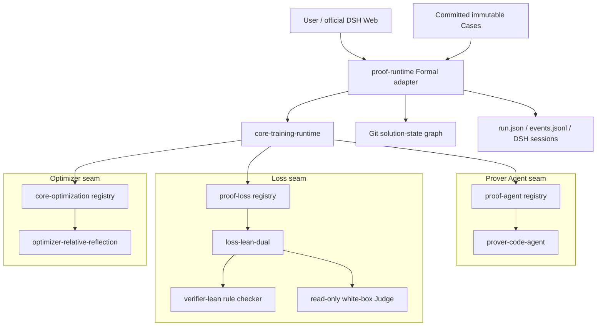

# DSH-native formal-proof architecture

[简体中文](../../zh-CN/architecture/dsh-formal-proof-bundle.md)

## System boundary and plugin seams

Formal proof is the first domain application of Tokens as Parameters. The Bundle composes three independently replaceable research plugins: a **Prover Agent** for forward search, a **Loss** for evaluating every resulting state, and an **Optimizer** for semantic feedback, text-parameter updates, and next-parent scheduling. `core-training-runtime` owns the policy-free Epoch loop; `proof-runtime` is the Formal adapter for Cases, DSH Sessions, Git worktrees, budgets, persistence, and proof-result projection.

The first release remains experiment-only over immutable repository Cases. Arbitrary user workspaces are tracked in [Issue #4](https://github.com/BruceLoveLee000/tokens-as-parameters/issues/4).



An ablation may change `prover`, `loss`, or `optimizer` independently while holding the Case, model, budgets, and remaining plugins fixed. The Bundle still reuses official DSH Code Agent, Agent Loop, native tools, context compaction, credentials, token accounting, Session persistence, and trajectory UI.

The default ids are `formal-code-agent`, `lean-dual-check`, and `relative-reflection`. `loss-lean-dual` also registers `lean-rule-only` for the black-box-only ablation. Every dual-Loss rollout sends its candidate source and checker receipt to the configured model's read-only Judge Session.

## Formal Prover Agent architecture

`proof-agent` defines the provider contract; `prover-code-agent` supplies the default domain meaning and context layout.

| Surface | First-release definition | Feedback status |
|---|---|---|
| immutable task | committed Case identity, locked manifest, theorem, model/spec inputs, and user run request | input; never updated by reflection |
| fixed system policy | locked surface, proof-source behavior, anti-reward-hacking rules, Insight behavior | frozen in this experiment |
| `task.memory` | concise verifier-backed facts, reusable discoveries, and invalidated assumptions | selectable per Agent instance; enabled by default |
| `task.plan` | shared proof-search policy and prioritization | selectable; enabled by default |
| `lane.<id>.route` | lane-specific independent assignment | selectable; enabled by default |
| tools | owner Session's official Code Agent preset plus `git_commit`, `record_insight`, `lean_check_candidate`, and `submit_proof_candidate` | frozen in this experiment |
| Skills | supplied by the installed DSH environment | no FDIV-specific Skill is bundled |

This table is the model definition for the current experiment. Core merely validates and versions the registered parameters. A future mathematical prover or Code Agent trainer can register different ids and descriptions without changing Core.

The three parameter sections have stable context positions. Before each Prover session, the Formal adapter records a context snapshot containing their exact revisions. The Reflector can therefore ask “where was this parameter revision used and what did the checker observe?” instead of inferring attribution from prose.

The Formal adapter uses DSH `agentPresets.composeFrom` so Prover and white-box Judge join the same preset generation as the owner Agent. Prover receives native `bash/read/write/edit/glob/grep/skill`; Judge receives the read-only subset. Outer lifecycle tools are unavailable. The Prover may create or refactor proof-side Lean files; `editableFiles` is a starting hint, while locked hashes and theorem signatures define the immutable boundary.

The Prover owns the timing and message of its exploratory Git checkpoints. It may inspect `git status`, `git diff`, and `git log` through the native shell, then call `git_commit(message)` to atomically commit the current safe proof-source changes. The dedicated write tool is necessary because a detached linked worktree stores writable Git metadata outside the Session workspace root; granting unrestricted shell escalation merely to update that metadata would widen authority unnecessarily. The tool performs no push, reset, rebase, or remote mutation. Runtime records the resulting node and may capture any remaining safe source changes at final submission, but it does not decide when the Prover should checkpoint. Every such commit remains untrusted until Loss evaluates it.

## Run and Epoch flow

Every start creates a new `runId`; separate Runs do not inherit mutable proof or parameter state. The source Case is copied into `<runRoot>/<runId>/workspace`, generated/dependency directories are excluded, locked hashes are checked again, and a new Git repository freezes the Run baseline. Manifest-declared external repositories must also be clean at their exact commits. A Case may declare a deterministic dependency-cache command (the FDIV adapter uses Mathlib's official cache fetch) that runs before the trusted baseline build. After preflight, the Lean verifier captures the resolved package tree once and hydrates each proof worktree with a copy-on-write clone. Generated project build/config output is still deleted before every trusted check, so cache reuse does not weaken candidate isolation or the checker boundary. Within a Run, state advances across Epochs. No candidate is written back to the source Case.

```mermaid
sequenceDiagram
  participant U as User
  participant C as Formal adapter
  participant T as Core Training Runtime
  participant P as Parallel Provers
  participant L as Loss plugin
  participant O as Optimizer Agent
  participant G as Git / run ledger

  U->>C: start(registered case id, budget, rollout count)
  C->>G: verify clean source commit; copy Case; initialize Run Git baseline
  C->>L: preflight frozen baseline; capture dependency cache
  C->>T: configure typed Formal hooks and initial state
  loop until proof or terminal budget
    T->>P: parameter state vN + optimizer-selected parent/task + isolated worktree
    P->>P: search, use tools, plan Git checkpoints, continue after request max-token boundaries
    P->>G: autonomously commit exploratory states and final Candidate
    G-->>L: Candidate Commit
    L->>L: Lean rule check + white-box Judge on that Commit
    L-->>T: commit-bound ProofReceipt + ProofLossReport
    T->>O: parameters + losses + eligible states + evidence tools
    O->>O: autonomously inspect traces, files, commits and diffs
    O-->>T: OptimizationDecision(update + next parents/tasks)
    T->>G: parameter state vN+1 + reflection decision node
  end
  T->>C: complete on solved, commit-matched Loss
  C->>G: persist final receipt and Loss report
```

Each lane has an independent DSH Session and detached Git worktree. Model steps—not cumulative cache-token volume—are the primary depth control. Defaults are 200 Prover steps, 24 white-box Judge steps, and 32 Reflector steps. At a role boundary its exploratory tools disappear and only its submit tool remains. Tokens still govern per-request output, context, global cost safeguards, and observability. Official DSH owns context compaction; full Session events and Git evidence remain queryable.

There is no automatic declaration transplantation and no `git merge` proof combiner. Every candidate is classified `VERIFIED`, `EXPLORATORY`, or `INVALID`. The Optimizer may select any verified or exploratory state independently for each next lane. Invalid states remain auditable but cannot become parents. When two branches contain complementary work, semantic integration is a normal Prover task from one chosen parent, followed by the same Loss evaluation.

## Relative reflection and information flow

The Reflector is a multi-step Agent. Its default context contains the parameter registry, exact exposure snapshots, structured Loss reports, and eligible solution-state ids. It can autonomously call:

- parameter-usage inspection;
- complete Loss and lane evidence inspection;
- bounded trace search and range reads;
- Git state-node listing;
- selected transition inspection with bounded diff and nearby trace context;
- bounded file reads at a visible commit;
- same-path comparison between two rollout states.

It submits one `OptimizationDecision`: replacements for any subset of feedback-enabled parameters plus exactly one eligible parent/task directive per next lane. Omitting a parameter preserves it. The controller atomically validates the parameter version, lane coverage, and state eligibility. At the step boundary inspection tools are removed and only `submit_reflection` remains. One invalid schema receives actionable feedback; a second invalid submission falls back to a neutral decision.

`git_commit(message)` lets a Prover choose an ordinary source-state transition without requesting shell escalation. `record_insight(summary, insight)` selects a higher-information cognitive/evidence transition: the Formal adapter writes the Insight and commits it in the same tree as all safe changed proof sources rather than using an `editableFiles` allowlist. Deleting an unlocked obsolete proof source is a valid transition; the verifier skips hygiene reads for absent files while independently enforcing locked hashes, theorem signatures, imports, the Lean build, and axiom audits. Reflection creates a provenance node containing parameter updates and next-lane scheduling; Git parentage records consumed states without pretending that their proof trees were merged.

## Trust boundary

Model prose, shell claims, reflection, Git commits, and Judge approval are untrusted individually. The configured Loss and controller require:

1. locked-input hashes match;
2. the theorem signature hash is unchanged;
3. every changed Lean proof source contains no `admit`, custom axiom, or unsafe declaration;
4. newly created proof views and helper files remain outside the locked surface;
5. the configured Lean build succeeds;
6. each counted obligation has an allowed `#print axioms` result;
7. dual Loss white-box review finds no semantic weakening or reward hacking;
8. final acceptance closes every declared obligation, and both Receipt and Loss identify the exact immutable Candidate Commit.

Before every trust check, the Verifier removes the lane's prior `.lake/build` and `.lake/config` outputs and rebuilds from the authorized sources. Generated compiler state therefore cannot become either an unauthorized-path false positive or a reusable model-controlled proof artifact.

The default Loss runs Lean and white-box review after every rollout, so a veto becomes immediate negative feedback to the Optimizer rather than a final-only surprise. A helper-only state can remain verified and selectable without being mislabeled obligation progress. Only a commit-matched, dual-Loss obligation gain advances the controller's trusted count; Runtime does not repeat the Lean build after evaluation.

The claim scope remains explicit. `lean-model-vs-spec` does not imply RTL fidelity without an independently versioned RTL-to-Lean certificate or adapter.

## Package responsibilities

| Package/plugin | Responsibility |
|---|---|
| `proof-contracts` | case, receipt, run, event, and Formal evaluation contracts |
| `core-training-runtime` | domain-neutral Rollout/Evaluation/Optimization/Epoch loop and cleanup guarantees |
| `proof-agent` | stable replaceable Prover provider contract and registry |
| `prover-code-agent` | default official-Code-Agent Prover definition and tools |
| `proof-loss` | stable replaceable formal Loss contract and registry |
| `loss-lean-dual` | owns immutable Candidate verification, white-box review, commit-bound Loss, and `lean-rule-only` ablation |
| `proof-runtime` | Formal adapter for Case/run state, Sessions, worktrees, budgets, evidence persistence, and stopping |
| `proof-observer` | durable run snapshots and domain-event ledger linked to DSH sessions |
| `proof-verification` | stable Verifier registry |
| `verifier-lean` | deterministic Lean rule checks |
| `core-optimization` | domain-neutral parameter/feedback/update contracts |
| `optimizer-relative-reflection` | semantic Optimizer Agent and per-lane parent/task scheduling |
| `tool-proof-run` | experiment Case discovery and user-facing lifecycle controls |
| `ui-proof-run` | DSH Web runtime view, session navigation, and direct stop control |

## FDIV experience review

The refactor was compared against the successful assisted FDIV 9/14 to 14/14 trace, not merely against the previous package API. The detailed [capability review](fdiv-capability-review.md) distinguishes retained behavior, deliberate scope changes, and unreproduced or missing capabilities.

The important conclusion is bounded: this implementation exposes the intended Prover/Loss/Optimizer ablation seams, preserves verified and exploratory branches, and lets reflection select future parents without an automatic merger. An aligned local pilot reproduced FDIV 14/14 from the same frozen 9/14 warm start as SpecRefine, establishing Prover/Runtime parity for that Case. It does not yet establish Optimizer effectiveness because every Run finished in Epoch 1, nor third-party reproduction because full evidence remains license-restricted. Certified `DISPROVED` handling is also absent.

Production workspace behavior—dirty Git state, non-Git initialization, namespaced refs, candidate patch application, and cleanup—is intentionally deferred to [Issue #4](https://github.com/BruceLoveLee000/tokens-as-parameters/issues/4), rather than weakening the experiment contract with a partially defined second mode.
