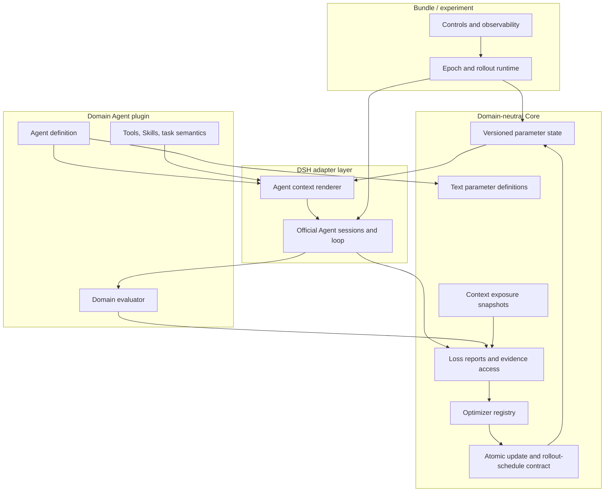
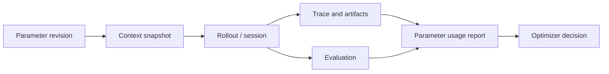
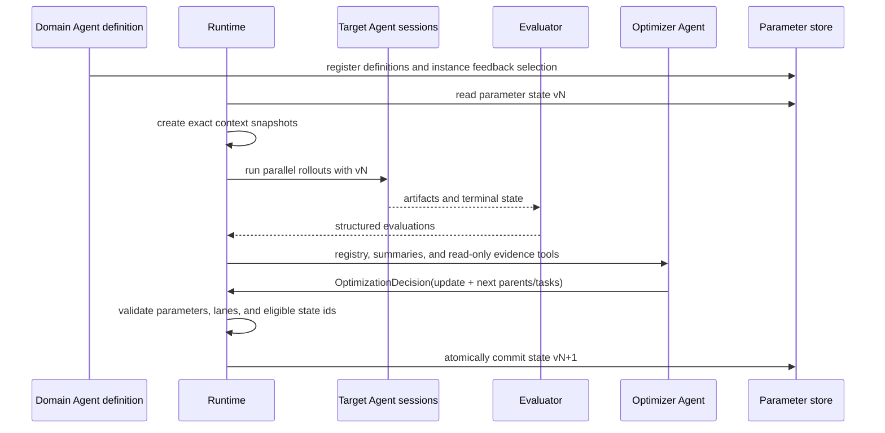

# Token-optimization Core architecture

[简体中文](../../zh-CN/architecture/token-optimization-core.md)

## Architectural decision

Tokens as Parameters trains an **Agent**, not the base language model and not a domain workflow hidden inside Core. An Agent's effective architecture is the composition of its fixed definition, tools, Skills, environment adapters, and versioned text parameters. A domain plugin defines that architecture; Core only supplies the domain-neutral mechanism for registering, exposing, evaluating, and updating text parameters.

A DSH Bundle is one deployable training system. It may compose a target Agent, an Optimizer Agent, Evaluators, persistence, and controls, but the Bundle itself is not the model.



The dependency direction is upward: Core does not import Formal, Lean, Chips, mathematics, Code Agent definitions, or benchmark packages.

## Mapping from weight training

The analogy is useful as an interface guide, not as a claim of differentiability.

| Weight training | Token optimization |
|---|---|
| model | Agent definition plus its instantiated parameters |
| tensor parameter | versioned `TextParameter` |
| `requires_grad` | instance-level `requiresFeedback` |
| forward pass | Agent rollout through tools and an environment |
| loss/reward | replaceable external `EvaluationRecord` / domain Loss plugin |
| activation/trace | session events, artifacts, and state transitions |
| gradient | semantic comparison inferred from evidence |
| `Optimizer.step()` | validated atomic `OptimizationDecision` |
| checkpoint | parameter state, solution state, optimizer state, and provenance |

The immutable user task is normally an input, not a trainable parameter. A domain Agent may register frozen text when provenance requires it, but observation alone does not make text trainable.

## Core concepts

### Text parameter definition and instance

`TextParameterDefinition` declares a stable id, scope, and a human-readable description of what the text controls. The description is operational: it tells an Optimizer Agent how the parameter influenced the target Agent and what a safe update means.

`TextParameterState` instantiates those definitions with content, revisions, and `requiresFeedback`. The Agent setup or experiment chooses which parameters are trainable. Core does not prescribe parameter names such as `route`, `proof plan`, or `Skill policy`.

```ts
const state = createTextParameterState({
  moduleId: 'example-agent',
  version: 'run-42/initial',
  parameters: [{
    definition: {
      id: 'search.policy',
      scope: 'run',
      description: 'Search policy that guides the next rollout group.',
    },
    content: 'Explore independently.',
    requiresFeedback: true,
  }],
})
```

The first release supports full-text replacement only. Update order and context layout remain fixed by the Agent definition so an early experiment does not silently train placement, templating, and content at the same time.

### Exposure and provenance

Before a rollout, the runtime records a `TextParameterContextSnapshot`. It identifies the exact parameter revisions exposed to that session. This closes the attribution chain:



The Optimizer can inspect usage by parameter id and then page traces or inspect selected Git transitions. It does not need the entire trajectory in its default prompt, and it does not have to guess which revision produced an outcome.

### Feedback and atomic update

`ParameterUpdatePlan` contains the base parameter-state version, a semantic reflection, and replacements for any subset of feedback-enabled parameters. Omitted parameters remain byte-for-byte unchanged. `OptimizationDecision` wraps that update together with one `RolloutDirective` per future lane. Each directive selects an eligible solution-state id and supplies a natural-language task. The controller rejects stale versions, duplicate updates, unknown ids, frozen parameters, missing lanes, and invalid solution parents before applying the decision.

This is deliberately simpler than patches, edit scripts, per-token gradients, or implicit merge semantics. Those mechanisms require evidence before entering the Core API.

### Four different states

The system must not collapse these into one object:

- **Parameter state** changes future Agent behavior.
- **Solution state** is the task artifact, such as Lean files and checker-trusted Git commits.
- **Optimizer state** is private memory retained by an optimization algorithm.
- **Trajectory/evidence** is an observation used for attribution; it is not automatically retained as a parameter.

An Evaluator may promote solution state. An Optimizer may propose parameter state. Neither authority implies the other.

## One optimization epoch



The relative-reflection implementation deliberately produces a semantic update rather than forcing a scalar advantage. The consumer is another language-model Agent, so high-bandwidth textual comparisons may carry useful information that a single number cannot. It also chooses the next solution-state parent independently for every lane. Scalar and hybrid Optimizers can still implement the same contract later.

## Package boundaries

| Package | Owns | Does not own |
|---|---|---|
| `core-optimization` | parameter, exposure, evaluation, eligible-state, rollout-directive, update, and Optimizer registry contracts | domain parameter ids, Loss semantics, or Agent prompts |
| `optimizer-relative-reflection` | autonomous evidence inspection and semantic update proposal | task acceptance or domain hints |
| `core-state-git` | Git-backed insight and parameter-transition provenance | proof semantics |
| `core-telemetry` | bounded DSH trace projection and exact token dimensions | training policy |
| domain packages | Agent definition, parameter descriptions/layout, tools, Skills, and evaluator adaptation | generic optimization contracts |
| Bundle | deployable composition and experiment defaults | a new Agent Loop or hidden domain logic |

The Cordis `ctx.optimization` service is a DSH adapter seam for registering Optimizer providers. The parameter and feedback contracts themselves remain independent of Formal or Lean.

## First-release constraints and deferred work

Implemented now:

- versioned full-text parameters with instance-level feedback selection;
- exact context exposure snapshots;
- structured evaluations and bounded evidence tools;
- atomic subset updates with stale/frozen validation;
- replaceable Optimizer providers, validated per-lane parent/task scheduling, and Git provenance.

Deferred until experiments justify them:

- learned parameter ordering or context placement;
- patch/append/merge update modes;
- slow global parameters shared across Runs;
- automatic credit assignment across overlapping parameters;
- numeric, semantic, and hybrid optimizer-state standards;
- distributed schedulers and a generic checkpoint server.

These are explicit research questions, not empty framework slots.
