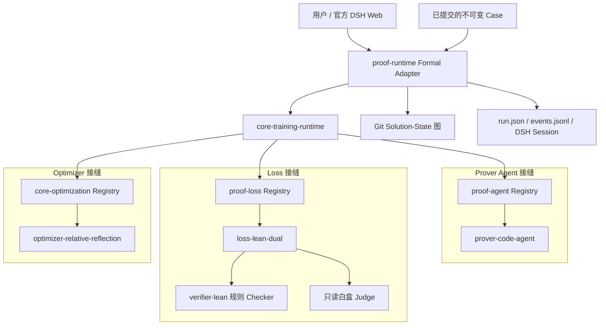
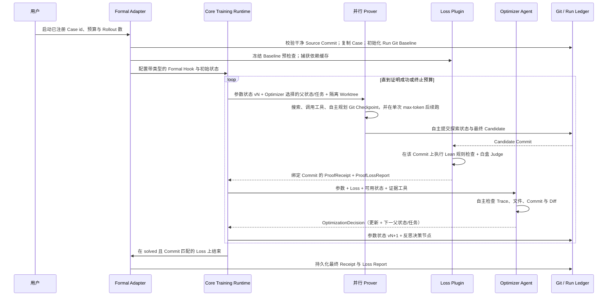

# DSH 原生形式化证明架构

[English](../../en/architecture/dsh-formal-proof-bundle.md)

## 系统边界与 Plugin 接缝

形式化证明是 Tokens as Parameters 的第一个领域应用。Bundle 组装三个可独立替换的研究 Plugin：负责前向搜索的 **Prover Agent**、负责评估每个结果状态的 **Loss**，以及负责语义反馈、文本参数更新和下一父状态调度的 **Optimizer**。`core-training-runtime` 负责无策略的 Epoch 循环；`proof-runtime` 是负责 Case、DSH Session、Git Worktree、预算、持久化与证明结果投影的 Formal Adapter。

第一版仍只支持仓库不可变 Case 上的实验模式。任意用户工作区由 [Issue #4](https://github.com/BruceLoveLee000/tokens-as-parameters/issues/4) 跟踪。

消融实验可以独立替换 `prover`、`loss` 或 `optimizer`，同时固定 Case、模型、预算及其他 Plugin。Bundle 继续复用官方 DSH Code Agent、Agent Loop、原生工具、上下文压缩、凭据、Token 计量、Session 持久化和轨迹 UI。

默认 ID 分别为 `formal-code-agent`、`lean-dual-check` 与 `relative-reflection`。`loss-lean-dual` 还注册 `lean-rule-only`，用于只保留黑盒规则检查的消融。每次双重 Loss Rollout 都会把 Candidate 源码与 Checker Receipt 交给配置模型的只读 Judge Session。

## Formal Prover Agent 架构

`proof-agent` 定义 Provider 契约；`prover-code-agent` 提供默认领域语义与上下文布局。

| 表面 | 第一版定义 | 反馈状态 |
|---|---|---|
| 不可变任务 | 已提交 Case 身份、锁定 Manifest、Theorem、Model/Spec 输入与用户 Run 请求 | 输入；反思永不修改 |
| 固定 System Policy | 锁定边界、证明源码行为、反作弊规则与 Insight 行为 | 本实验冻结 |
| `task.memory` | 简洁的 Verifier 证据、可复用发现与被否定假设 | Agent 实例可选择；默认开放 |
| `task.plan` | 公共证明搜索策略与优先级 | 可选择；默认开放 |
| `lane.<id>.route` | 每路独立搜索任务 | 可选择；默认开放 |
| 工具 | 继承宿主 Session 的官方 Code Agent Preset，加 `git_commit`、`record_insight`、`lean_check_candidate` 与 `submit_proof_candidate` | 本实验冻结 |
| Skill | 由安装的 DSH 环境提供 | Bundle 不携带 FDIV 专属 Skill |

这张表就是当前实验的模型定义。Core 只校验和版本化已注册参数。未来数学 Prover 或 Code Agent Trainer 可以注册完全不同的 ID 和描述，无需修改 Core。

三个参数 Section 的上下文位置固定。每个 Prover Session 开始前，Formal Adapter 都记录包含精确 Revision 的上下文快照。Reflector 因此可以查询“这个参数版本在哪里被使用、Checker 看到了什么结果”，而不是从模型文字中猜归因。

Formal Adapter 通过 DSH `agentPresets.composeFrom` 让 Prover 和白盒 Judge 复用宿主 Agent 的 Preset Generation。Prover 使用原生 `bash/read/write/edit/glob/grep/skill`，Judge 使用只读子集；外层生命周期工具不会进入它们的可调用面。Prover 可以创建或重构证明侧 Lean 文件；`editableFiles` 只是起始提示，锁定 Hash 与定理 Signature 才定义不可变边界。

探索性 Git Checkpoint 的提交时机与 Commit Message 由 Prover 自主决定。它可以通过原生 Shell 检查 `git status`、`git diff` 与 `git log`，再调用 `git_commit(message)` 原子提交当前全部安全证明源码变更。之所以提供专用写工具，是因为 Detached Linked Worktree 的可写 Git Metadata 位于 Session Workspace Root 之外；若只为更新这些 Metadata 就允许任意 Shell 提权，会不必要地扩大权限。该工具不会执行 Push、Reset、Rebase 或修改 Remote。Runtime 记录生成的节点，并可在最终提交时捕获尚未提交的安全源码，但不会替 Prover 决定何时建立 Checkpoint。所有这类 Commit 在经过 Loss 评估前都不受信。

## Run 与 Epoch 执行流

每次 Start 都创建新的 `runId`，不同 Run 不继承可变证明或参数状态。源 Case 会被复制到 `<runRoot>/<runId>/workspace`；生成目录和依赖目录会被排除；锁定 Hash 会再次校验；新的 Git 仓库会冻结 Run Baseline。Manifest 声明的外部仓库也必须处于干净状态和精确 Commit。Case 可以声明确定性的依赖缓存命令（FDIV Adapter 使用 Mathlib 官方缓存下载），它会在受信 Baseline Build 前执行。预检查后，Lean Verifier 只捕获一次解析完成的 Package Tree，再用写时复制把它播种到每个证明 Worktree。每次受信检查前仍会删除项目自身的 Build/Config 产物，因此缓存复用不会削弱 Candidate 隔离或 Checker 边界。同一 Run 内跨 Epoch 演进，任何 Candidate 都不会写回源 Case。

每路拥有独立 DSH Session 和 Detached Git Worktree。模型 Step 是主要深度控制：默认 Prover 200 Step、白盒 Judge 24 Step、Reflector 32 Step。达到边界后移除探索工具，只保留提交工具。Token 仍控制单次输出、上下文、全局成本保护与可观测性，但 Cache Read 不再提前终止 Rollout。上下文压缩由官方 DSH 负责，完整 Session Event 与 Git 证据仍可按需查询。

系统不再自动移植声明，也不使用 `git merge` 合并证明。每个 Candidate 被分类为 `VERIFIED`、`EXPLORATORY` 或 `INVALID`。Optimizer 可以为下一轮每条 Lane 独立选择任意 Verified/Exploratory 状态；Invalid 状态只保留审计，不能成为父状态。两个分支互补时，语义整合是一个普通 Prover 任务，随后仍经过同一 Loss。

## 相对反思与信息流

Reflector 是多 Step Agent。默认上下文包含参数注册表、精确暴露快照、结构化 Loss Report 和可用 Solution-State ID；它可以自主调用：

- 参数使用情况检查；
- 完整 Loss 与 Lane Evidence 检查；
- 有界 Trace 搜索与分页读取；
- Git 状态节点列表；
- 选定状态转移的有界 Diff 与相邻 Trace 上下文；
- Visible Commit 上的有界文件读取；
- 两个 Rollout State 同一路径的比较。

它提交一个 `OptimizationDecision`：任意一组开放反馈参数的替换，以及每条下一轮 Lane 唯一的合法父状态/任务。省略参数即保持。Controller 原子校验参数版本、Lane 完整性和状态资格。达到 Step 边界后检查工具被移除，只保留 `submit_reflection`；第一次 Schema 错误获得可操作反馈，第二次错误回退为中性决策。

`git_commit(message)` 让 Prover 无需请求 Shell 提权即可自主选择普通源码状态转移。`record_insight(summary, insight)` 用于选择信息密度更高的认知/证据状态转移：Formal Adapter 写入 Insight，并把它与所有安全的已变更证明源码提交到同一棵 Tree，而不再依赖 `editableFiles` 白名单。删除未锁定、已经废弃的证明源码也是合法状态转移；Verifier 会跳过对不存在文件的 Hygiene 读取，同时独立执行锁定 Hash、Theorem Signature、Import、Lean Build 与 Axiom Audit。反思节点保存参数更新与下一轮调度；Git Parent 记录所消费状态，但不伪装成证明树已经合并。

## 信任边界

模型文字、Shell 声称、反思、Git Commit 与 Judge 批准单独看都不受信。配置的 Loss 与 Controller 要求：

1. 锁定输入 Hash 一致；
2. 顶层定理 Signature Hash 不变；
3. 所有变更的 Lean 证明源码都不含 `admit`、自定义 Axiom 或 Unsafe Declaration；
4. 新建 Proof View 与 Helper 文件位于锁定面之外；
5. 配置的 Lean Build 成功；
6. 每个计数 Obligation 都有符合白名单的 `#print axioms` 结果；
7. 双重 Loss 的白盒审查没有发现语义弱化或 Reward Hacking；
8. 最终验收关闭全部 Obligation，且 Receipt 与 Loss 都标识同一个不可变 Candidate Commit。

每次信任检查前，Verifier 都会删除该 Lane 先前的 `.lake/build` 与 `.lake/config` 产物，并从授权源码重新构建。因此，编译器生成状态既不会被误判成越权源码修改，也不能成为模型可复用的证明作弊产物。

默认 Loss 在每个 Rollout 后执行 Lean 与白盒审查，因此否决会立即成为 Optimizer 的负反馈，而不是最终阶段才出现。Helper-only 状态可以保持 Verified 并被后续选择，但不会被误标成 Obligation 正向收益；只有 Commit 匹配的双重 Loss Obligation 增益才推进可信计数，Runtime 不会在 Evaluation 后重复执行 Lean Build。

Claim Scope 必须显式。`lean-model-vs-spec` 在缺少独立版本化 RTL-to-Lean 证书或 Adapter 时，不代表 RTL Fidelity。

## Package 职责

| Package/Plugin | 职责 |
|---|---|
| `proof-contracts` | Case、Receipt、Run、Event 与 Formal Evaluation 契约 |
| `core-training-runtime` | 领域无关的 Rollout/Evaluation/Optimization/Epoch 循环与清理保证 |
| `proof-agent` | 稳定、可替换的 Prover Provider 契约与 Registry |
| `prover-code-agent` | 默认官方 Code Agent Prover 定义与工具 |
| `proof-loss` | 稳定、可替换的 Formal Loss 契约与 Registry |
| `loss-lean-dual` | 完整拥有不可变 Candidate 校验、白盒审查、Commit 绑定 Loss 与 `lean-rule-only` 消融 |
| `proof-runtime` | Formal Case/Run 状态、Session、Worktree、预算、证据持久化与停止 Adapter |
| `proof-observer` | 持久 Run Snapshot 与关联 DSH Session 的领域事件账本 |
| `proof-verification` | 稳定 Verifier 注册中心 |
| `verifier-lean` | 确定性 Lean 规则检查 |
| `core-optimization` | 领域无关参数、反馈与更新契约 |
| `optimizer-relative-reflection` | 语义 Optimizer Agent 与逐 Lane 父状态/任务调度 |
| `tool-proof-run` | 实验 Case 发现与用户可见生命周期控制 |
| `ui-proof-run` | DSH Web 运行视图、Session 跳转与直接停止控制 |

## FDIV 经验审查

本次重构不是只和旧 Package API 对比，而是对照了成功的 FDIV 9/14 到 14/14 辅助实验轨迹。详细[能力回退审查](fdiv-capability-review.md)区分了保留能力、主动收缩的范围，以及尚未复现或仍缺失的能力。

结论必须保持边界：当前实现已经暴露预期的 Prover/Loss/Optimizer 消融接缝，保留 Verified 与 Exploratory 分支，并允许反思选择下一父状态而不自动合并。对齐的本地先导实验已经从与 SpecRefine 相同的冻结 9/14 Warm Start 复现 FDIV 14/14，证明该 Case 上的 Prover/Runtime 能力对齐；但全部 Run 都在 Epoch 1 完成，因此尚未证明 Optimizer 有效性，完整证据又受许可证约束，因此也不是第三方公开复现。认证 `DISPROVED` 链路同样仍缺失。

生产工作区行为——脏 Git 状态、非 Git 初始化、命名空间 Ref、Candidate Patch Apply 与清理——有意推迟到 [Issue #4](https://github.com/BruceLoveLee000/tokens-as-parameters/issues/4)，避免用一个定义不完整的第二模式削弱实验契约。
