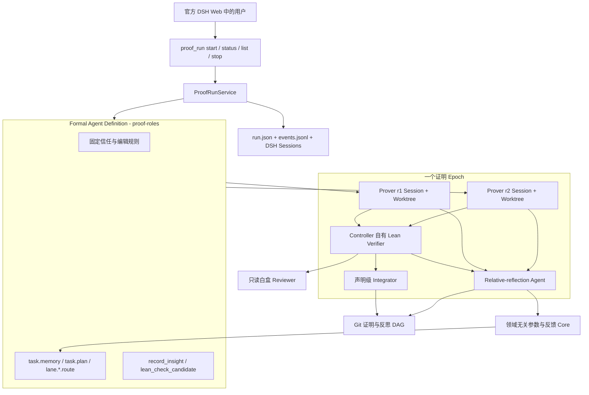
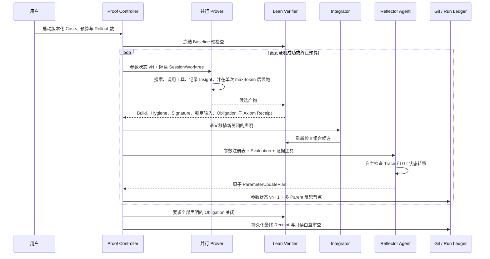

# DSH 原生形式化证明架构

[English](../../en/architecture/dsh-formal-proof-bundle.md)

## 系统边界

形式化证明是 Token Optimization Core 的第一个领域应用。`proof-roles` 定义 Formal Prover Agent 架构，Core 不定义它。可安装 Bundle 在 DSH 官方 Code Agent 与 Agent Loop 之上，把该 Agent 与自主 Reflector、确定性 Lean 验证、Git 状态、可观测性和用户控制组装起来。

Bundle 只负责组装，不重复实现 Code Agent、Agent Loop、文件/Shell 工具、上下文压缩、凭据、Token 计量、Session 持久化或 Web 轨迹界面。

## Formal Prover Agent 架构

`proof-roles` 负责目标 Agent 的领域含义与上下文布局。

| 表面 | 第一版定义 | 反馈状态 |
|---|---|---|
| 不可变任务 | 锁定 Manifest、Theorem、Model/Spec 输入与用户 Run 请求 | 输入；反思永不修改 |
| 固定 System Policy | 可编辑面、信任边界、反作弊规则与 Insight 行为 | 本实验冻结 |
| `task.memory` | 简洁的 Verifier 证据、可复用发现与被否定假设 | Agent 实例可选择；默认开放 |
| `task.plan` | 公共证明搜索策略与优先级 | 可选择；默认开放 |
| `lane.<id>.route` | 每路独立搜索任务 | 可选择；默认开放 |
| 工具 | 官方 Code Agent 工具，加 `record_insight` 与 `lean_check_candidate` | 本实验冻结 |
| Skill | 由安装的 DSH 环境提供 | Bundle 不携带 FDIV 专属 Skill |

这张表就是当前实验的模型定义。Core 只校验和版本化已注册参数。未来数学 Prover 或 Code Agent Trainer 可以注册完全不同的 ID 和描述，无需修改 Core。

三个参数 Section 的上下文位置固定。每个 Prover Session 开始前，Runtime 都记录包含精确 Revision 的上下文快照。Reflector 因此可以查询“这个参数版本在哪里被使用、Checker 看到了什么结果”，而不是从模型文字中猜归因。

## Run 与 Epoch 执行流

每次 Start 都创建新的 `runId`，不同 Run 不继承可变证明或参数状态；同一 Run 内跨 Epoch 演进。

每路拥有独立 DSH Session 和 Detached Git Worktree。若一次响应因为输出上限结束，只要该路累计预算仍有剩余，就在同一 Session 中继续。停滞和路线同质化属于需要观测的实验现象，不是硬编码停止条件。Run 只因证明通过、用户取消、总 Token/总时长耗尽或不可恢复的基础设施错误而结束。

## 相对反思与信息流

Reflector 是 Agent，不是一次 Completion。默认上下文包含参数注册表、精确暴露快照和结构化 Lane Evaluation；它可以自主调用：

- 参数使用情况检查；
- Lane Evidence 检查；
- 有界 Trace 搜索与分页读取；
- Git 状态节点列表；
- 选定状态转移的有界 Diff 与相邻 Trace 上下文。

它可以替换任意一组开放反馈参数；省略即保持。Controller 针对精确 Base Version 原子应用更新。超过反思软证据预算后，检查工具被移除，并在当前对话注入 Submit-only 指令；第一次 Schema 错误获得可操作反馈，第二次错误回退为中性更新。

`record_insight(summary, insight)` 让 Prover 主动选择高信息密度的认知/证据状态转移。Runtime 写入 Insight 文件，并与当前可编辑证明状态一起 Commit。随后反思创建多 Parent Git 节点，Parent 记录所有被消费的 Lane Tip；其 Tree 仍来自 Controller 选择的证明状态，因此来源关系不会伪装成语义 `git merge`。

## 信任边界

模型文字、Shell 声称、反思与 Reviewer 批准都不受信。只有 Controller 自有检查可以推进命名证明进度：

1. 锁定输入 Hash 一致；
2. 顶层定理 Signature Hash 不变；
3. 修改路径位于授权范围；
4. 不引入 `admit`、自定义 Axiom 或 Unsafe Declaration；
5. 配置的 Lean Build 成功；
6. 每个计数 Obligation 都有符合白名单的 `#print axioms` 结果；
7. 最终验收关闭全部 Obligation，包括顶层定理。

声明级整合会同时携带新关闭的命名 Obligation，以及通过 Lean 与 Axiom 检查的新增/修改 Helper Theorem；组合文件会被重新检查，绝不使用分支 Merge 充当证明合并器。白盒审查只有否决权：它可以因语义弱化或 Reward Hacking 拒绝确定性成功，但不能凭空制造成功。

Claim Scope 必须显式。`lean-model-vs-spec` 在缺少独立版本化 RTL-to-Lean 证书或 Adapter 时，不代表 RTL Fidelity。

## Package 职责

| Package/Plugin | 职责 |
|---|---|
| `proof-contracts` | Case、Receipt、Run、Event 与 Formal Evaluation 契约 |
| `proof-roles` | Formal Prover 参数定义/上下文布局与 Prover/Reviewer 工具 |
| `proof-runtime` | Run 状态机、参数、Session、Worktree、预算、整合与停止 |
| `proof-observer` | 持久 Run Snapshot 与关联 DSH Session 的领域事件账本 |
| `proof-verification` | 稳定 Verifier 注册中心 |
| `verifier-lean` | 确定性 Lean 检查与命名声明整合 |
| `core-optimization` | 领域无关参数、反馈与更新契约 |
| `optimizer-relative-reflection` | 可替换语义 Optimizer Agent |
| `tool-proof-run` | 用户可见生命周期控制 |

## FDIV 经验审查

本次重构不是只和旧 Package API 对比，而是对照了成功的 FDIV 9/14 到 14/14 辅助实验轨迹。详细[能力回退审查](fdiv-capability-review.md)区分了保留能力、主动收缩的范围，以及尚未复现或仍缺失的能力。

结论必须保持边界：新实现保留了核心搜索与信任闭环，恢复了 Checker-clean Helper-only Checkpoint 的跨 Epoch 晋升，并改善了文本参数归因，但还不能宣称与历史系统证据等价。FDIV 14/14 尚未通过该 Bundle 复跑，认证 `DISPROVED` 链路仍缺失。
