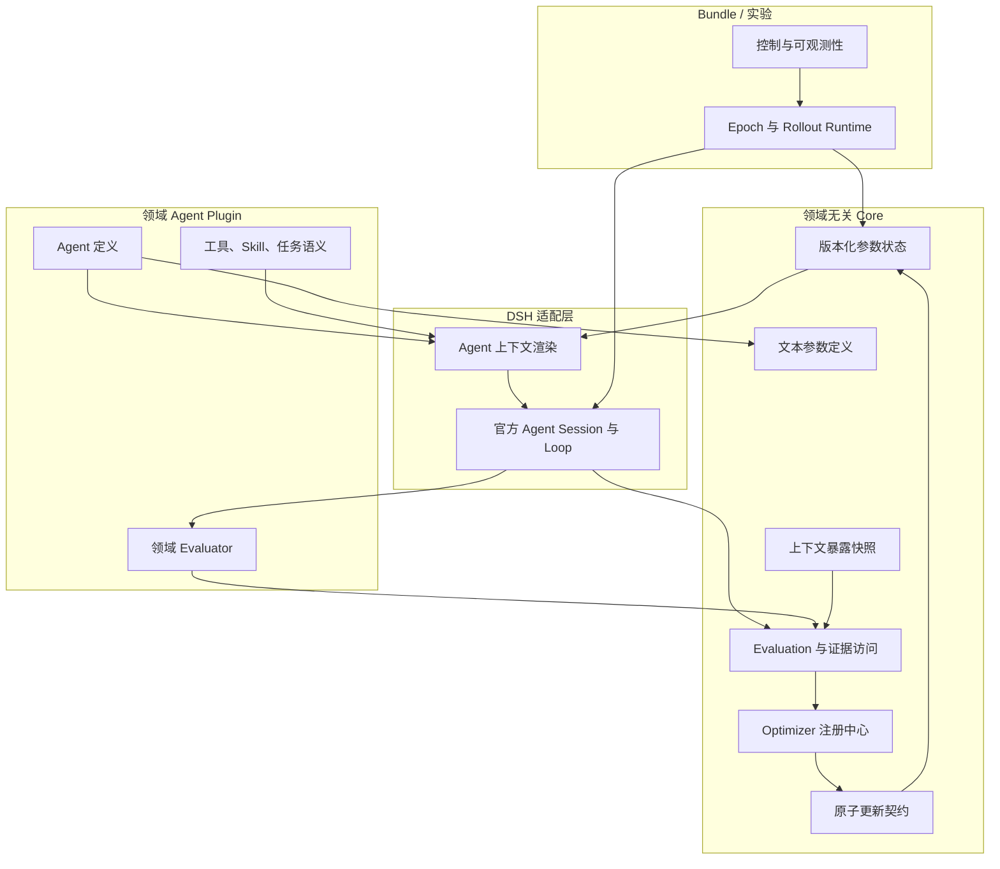
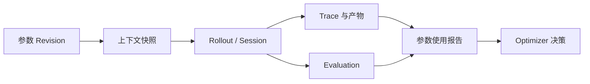
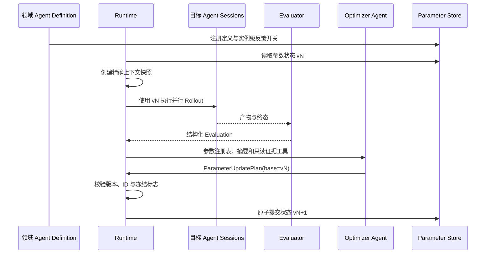

# Token Optimization Core 架构

[English](../../en/architecture/token-optimization-core.md)

## 架构决策

Tokens as Parameters 要训练的是 **Agent**，不是基础大模型，也不是藏在 Core 中的某个领域工作流。一个 Agent 的有效架构由固定定义、工具、Skill、环境适配器以及版本化文本参数共同构成。领域 Plugin 负责定义这套架构；Core 只提供注册、暴露、评估和更新文本参数的领域无关机制。

DSH Bundle 是一套可部署的训练系统。它可以组装目标 Agent、Optimizer Agent、Evaluator、持久化与控制能力，但 Bundle 自身不是模型。



依赖方向只能向上：Core 不得导入 Formal、Lean、Chips、数学、Code Agent 定义或 Benchmark Package。

## 与权重训练的映射

这组映射用于指导接口设计，并不声称文本更新可微。

| 权重训练 | Token Optimization |
|---|---|
| 模型 | Agent 定义及其实例化参数 |
| Tensor Parameter | 版本化 `TextParameter` |
| `requires_grad` | 实例级 `requiresFeedback` |
| 前向传播 | Agent 通过工具和环境执行 Rollout |
| Loss/Reward | 外部 `EvaluationRecord` |
| Activation/Trace | Session Event、产物与状态转移 |
| Gradient | 从证据比较中推断出的语义信号 |
| `Optimizer.step()` | 经过校验的原子 `ParameterUpdatePlan` |
| Checkpoint | 参数状态、解状态、优化器状态与来源链 |

不可变的用户任务通常是输入，不是可训练参数。若来源追踪需要，领域 Agent 也可以注册冻结文本；但一段文本被观察到，并不意味着它自动成为参数。

## Core 核心概念

### 文本参数定义与实例

`TextParameterDefinition` 声明稳定 ID、作用域以及对参数用途的自然语言描述。这段描述不是注释装饰：它告诉 Optimizer Agent，该文本如何影响目标 Agent，以及怎样更新才是安全的。

`TextParameterState` 用具体内容、Revision 与 `requiresFeedback` 实例化这些定义。Agent Setup 或实验配置决定哪些参数可训练。Core 不预设 `route`、`proof plan` 或 `Skill policy` 等参数名。

```ts
const state = createTextParameterState({
  moduleId: 'example-agent',
  version: 'run-42/initial',
  parameters: [{
    definition: {
      id: 'search.policy',
      scope: 'run',
      description: '控制下一组 Rollout 的搜索策略。',
    },
    content: '从彼此独立的方向探索。',
    requiresFeedback: true,
  }],
})
```

第一版只支持整段文本替换。参数顺序和上下文位置由 Agent Definition 固定，避免早期实验同时训练位置、模板和内容，导致归因混乱。

### 暴露与来源链

每次 Rollout 前，Runtime 都会记录 `TextParameterContextSnapshot`，精确标识该 Session 实际看到的参数 Revision，从而闭合归因链：



Optimizer 可以先按 Parameter ID 查询使用情况，再分页读取 Trace 或检查选中的 Git 状态转移。它无需在默认 Prompt 中吞下完整轨迹，也无需猜测某个结果由哪个参数版本产生。

### 反馈与原子更新

`ParameterUpdatePlan` 包含基础状态版本、语义反思，以及任意一组开放反馈参数的新文本。没有出现在 Updates 中的参数逐字保持不变。Controller 会在整体应用前拒绝过期版本、重复更新、未知 ID 和对冻结参数的修改。

该设计刻意比 Patch、编辑脚本、逐 Token 梯度或隐式 Merge 更简单。只有实验出现明确需求并提供证据后，复杂机制才应进入 Core API。

### 四类状态必须分开

- **Parameter State**：改变未来 Agent 行为的文本状态；
- **Solution State**：Lean 文件、受信 Git Commit 等任务产物；
- **Optimizer State**：某种优化算法私有的跨轮记忆；
- **Trajectory/Evidence**：用于归因的执行观测，不会自动成为参数。

Evaluator 可以晋升 Solution State，Optimizer 可以提出 Parameter State 更新；两种权限不能互相替代。

## 一个优化 Epoch



Relative Reflection 实现有意输出语义更新，而不是强制压成标量 Advantage。它的消费者也是语言模型 Agent，高带宽文本比较可能传递单个数字无法表达的信息。未来的数值或混合 Optimizer 仍可实现同一契约。

## Package 边界

| Package | 负责 | 不负责 |
|---|---|---|
| `core-optimization` | 参数、暴露、Evaluation、更新与 Optimizer 注册契约 | 领域参数 ID 或 Agent Prompt |
| `optimizer-relative-reflection` | 自主检查证据并提出语义更新 | 验收任务结果或注入领域答案 |
| `core-state-git` | Git 支撑的 Insight 与参数状态转移来源链 | 证明语义 |
| `core-telemetry` | 有界 DSH Trace 投影与精确 Token 维度 | 训练策略 |
| 领域 Package | Agent 定义、参数说明/布局、工具、Skill 与 Evaluator 适配 | 通用优化契约 |
| Bundle | 可部署组装与实验默认值 | 另造 Agent Loop 或暗藏领域逻辑 |

Cordis `ctx.optimization` Service 是注册 Optimizer Provider 的 DSH 适配缝。参数和反馈契约本身仍与 Formal、Lean 无关。

## 第一版约束与后续研究

当前已实现：

- 版本化整段文本参数与实例级反馈选择；
- 精确上下文暴露快照；
- 结构化 Evaluation 和有界证据工具；
- 带过期/冻结校验的原子子集更新；
- 可替换 Optimizer Provider 与 Git 来源记录。

等待实验驱动后再实现：

- 可学习的参数顺序或上下文位置；
- Patch、Append 或 Merge 更新模式；
- 跨 Run 共享的慢速全局参数；
- 多个重叠参数之间的自动 Credit Assignment；
- 数值、语义与混合 Optimizer State 标准；
- 分布式调度与通用 Checkpoint Server。

这些是明确的研究问题，不是需要提前填满的框架空槽位。
